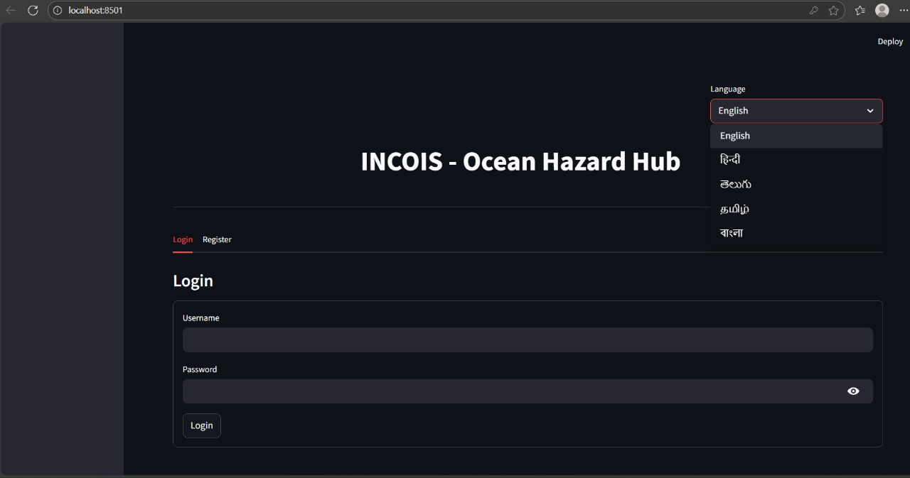
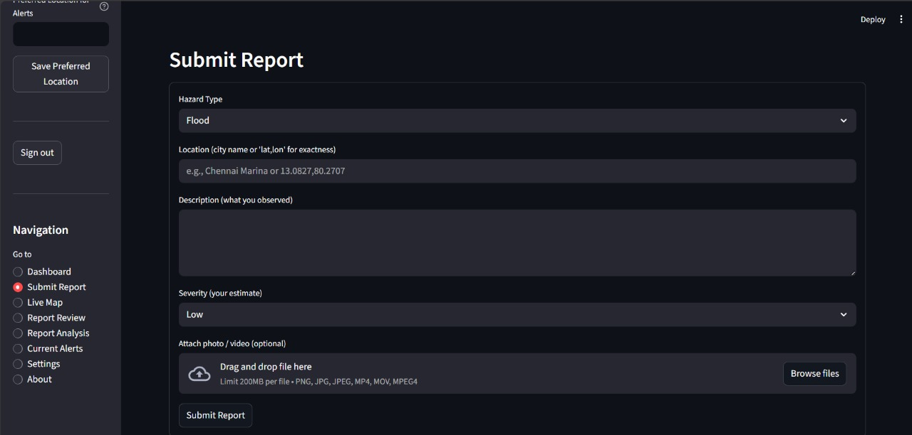
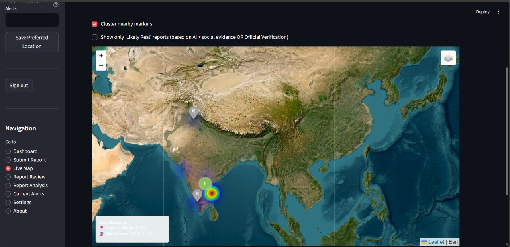
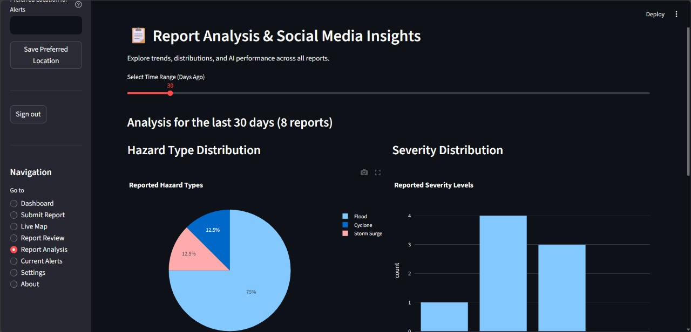
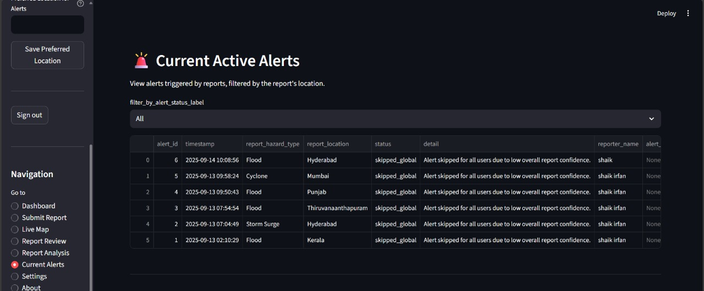

# 🌊 Ocean Hazard Reporting System

An AI-powered citizen reporting and hazard alert platform for coastal safety.  
Built for **SIH 2025 Internal Hackathon** 🚀 by **Team Catalyst**  

---

## 🔑 Features
- 📢 **Citizen Reports**: Submit hazards like floods, cyclones, oil spills  
- 🤖 **AI Verification**: Classifies reports as real or misinformation  
- 🗺️ **Interactive Map Dashboard**: Live hazard hotspots, heatmaps, clustering  
- 📊 **Analytics Dashboard**: Hazard trends, AI confidence, severity stats  
- 🚨 **Alert System**: Multi-channel notifications (SMS, Email, Push, Webhook)  

---

## ⚙️ Tech Stack
- **Frontend**: Streamlit + Plotly  
- **Mapping**: Folium + Leaflet plugins  
- **AI Model**: Transformers (HuggingFace)  
- **Backend**: Python  
- **Alerts**: Email, SMS, Push (demo mode)  

---

## 🚀 Quick Start

```bash
# Clone the repo
git clone https://github.com/YOUR_USERNAME/ocean-hazard-reporting.git
cd ocean-hazard-reporting

# Install dependencies
pip install -r requirements.txt

# Run the Streamlit app
streamlit run app.py

```

## 📸 Screenshots

### 🔐 Login Page


### 📝 Report Submission


### 🌍 Hazard Map


### 📊 Analytics


### 🚨 Alerts

